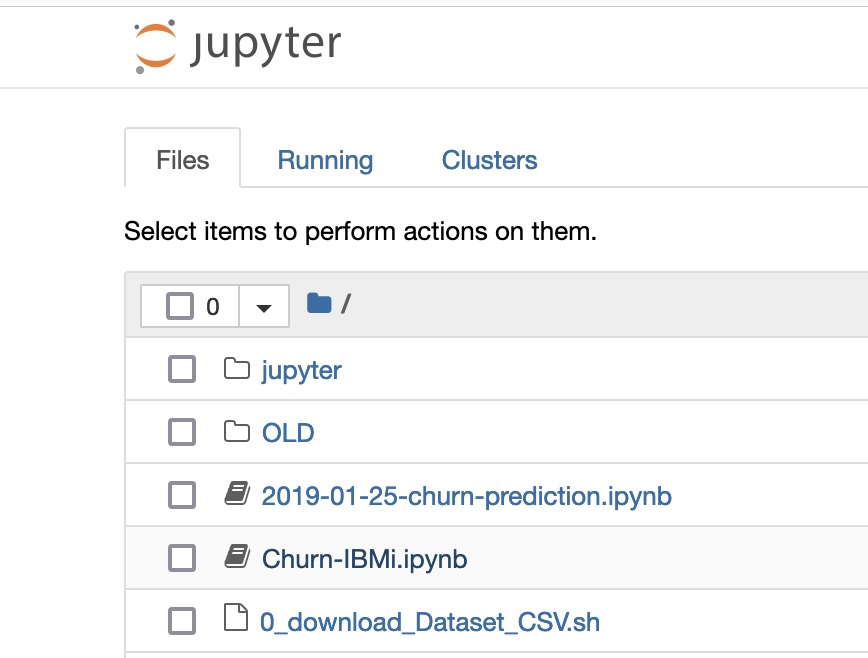

# IBM i & Machine Learning 101
###  "firstdemo-scikitlearn-ibmi" repository

How to simply use machine learning on IBM i ? this repository illustrates the use of real time scoring and data visualization open source technologies on IBM i, close to business critical applications and data. #IBMi #AI #watsonx #ItIsNotAS400 

Proposed scenario: In this notebook: 
1) extract data from Db2 for i or a CSV file, 
2) create and prepare your datasets
3) visualize data
4) create a supervised classification model (https://scikit-learn.org/stable/modules/svm.html) . 

Resulting model can be tested and evaluated, and persisted on disk on IBM i for inference, or exported on an accelerated server or even Watson Machine Learning (on prems, Cloud). It is persisted on disk using joblib (pip install joblib)  in the SVC_Model_CHURN_IBMi_V1.joblib file on the IFS file system.

In this simple scenario, we manage to get an accuracy of 0.8, recall 0.7, which is good starting point!! 

The code can be found in the [Jupyter Notebook](https://github.com/bmarolleau/firstdemo-scikitlearn-ibmi/blob/master/Churn-IBMi.ipynb) for interactive execution and data visualization. 

Use the Python standalone scripts in the [scripts](./scripts/) folder for running the demo in 'batch' mode, closer to real life scenario. 


## Documentation
- Main asset of this repo is this [Jupyter Notebook](https://github.com/bmarolleau/firstdemo-scikitlearn-ibmi/blob/master/Churn-IBMi.ipynb)

- Cool presentation [Augment your Apps with H2O Driverless AI, Scikit-Learn & Machine Learning on IBM i](https://ibm.box.com/v/machinelearning-ibmi)  

- Watson ML & Scikit learn tutorial [here](https://github.com/IBM/customer-churn-prediction/blob/master/notebooks/customer-churn-prediction.ipynb) 


## How to use this repository ? 

This asset demonstrates the use of open-source Python technologies to visualize DB2 for i data with dashboards, use your data to create predictive scoring with regression algorithms, or classification, all on IBM i. This application uses scikit-learn, pandas, seaborn, matplotlib libraries , jupyter and ipython. 

-  Simply launch jupyter on your machine  
```jupyter notebook --port 8888 --ip <your-ip>``` 
-  Python/IPython step by step alternative: Execute python scripts sequentially or use Interactive python with  ``` run -i %<FILE-NAME.py> ```  , where FILE-NAME.py is the name of each python script from step 0 to 20. Respect the order, as each script depends on the previous one. 

### Dataset 
- Dataset used is the CSV file ``` WA_Fn-UseC_-Telco-Customer-Churn.csv```  in that particular example. You can use IBM ACS to create a Db2 table from the CSV and use the ```0_load_Dataset_Db2.py```  to load the data from this table.

## Setup Details : IBM i & Machine Learning setup instructions
 
1/ Install necessary packages (yum)
``` bash
yum install tcl tk python39 python39-* libzmq libffi6.ppc64 git ca-certificates-mozilla.noarch ca-certificates.noarch vim.ppc64 ninja* *-devel *blas *libstd* libpng* pkg-config libfreetype6 gcc* gcc-c++
```
2/ Install python packages
``` bash
pip3.9 install -r requirements
```
3/ Start Jupyterlab 
``` bash
jupyter notebook --port 8888 --ip <YOURIP>
```
4/ Open the notebook you previously cloned on your IBM i. Then, refer to this [Jupyter Notebook](https://github.com/bmarolleau/firstdemo-scikitlearn-ibmi/blob/master/Churn-IBMi.ipynb) for more instructions on how to get started with scikit learn.


## Reference links (chroot, Machine learning etc.)

- [IBM Documentation: chroot and ssh ](https://www.ibm.com/support/pages/using-chroot-ibm-i-restrict-ssh-sftp-and-scp-specific-directories)
- [ IFS containers ](https://techchannel.com/open-source-on-ibm-i/getting-started-with-ifs-containers/)
- [IBM i OSS](https://ibm.github.io/ibmi-oss-resources/)
- [scikit learn](https://scikit-learn.org/stable/)

## Notes - Dependencies and python version
This application can upgraded to more recent Python versions available on IBM i. Just make sure your dependencies are aligned with the chosen Python version. 

IBM i yum repositories include pre-compiled python packages for Python 3.6 and 3.9. For python 3.6:  ```python3-numpy v1.15.4 , python3-Pillow v5.0.0 , python3-pandas v0.22.0 , python3-scipy v1.1.0, python3-scikit-learn v1.0.1``` , ppc64 architecture. These packages will be installed during the setup process detailed below. 
-  Please note that we install here all  ```python39-* ```packages (python version 3.6)  and GCC version 10+ is mandatory, so make sure gcc points to gcc 10 on your system or inside your chroot  ( ```gcc -v``` , use ```ln -s gcc-10 /QOpenSys/pkgs/bin/gcc``` if necessary). 
- GCC 10 is required to compile various python dependencies to avoid headers conflict like "time.h:124:3: error: conflicting types for 'sigset_t'"  when using GCC 6. 
-  If you use a chroot container, note that we use in step 3 a custom chroot_setup_script.sh script that normally resides in ```/QOpenSys/QIBM/ProdData/SC1/OpenSSH/sbin/chroot_setup_script.sh``` that we modified to be able to specify a ```CHROOT_PATH``` . Please let me know if there is an easier process with chroot_setup or other standard scripts ^^ 
- Here, requirements.txt mentions matplotlib version 3.2, which compiles fine. Feel free to upgrade matplotlib to a more recent version adapting the dependency list accordinlgy.

Bonus -  Step by step instructions in a chroot container:
-------
1/ Install ibmichroot  – each user will be using a "chroot jail" :
 ``` bash
[13:59:12][DEMOP.IBM.COM][~]# yum install ibmichroot
 ``` 
2/ (optional) Create user profile 
``` bash
[14:36:54][DEMOP.IBM.COM][~]# system "CRTUSRPRF USRPRF(MLUSR1) USRCLS(*PGMR) "
 ```
3/ chroot settings for ssh
``` bash
[17:15:08][DEMOP.IBM.COM][/QOpenSys/mop_chroots]# ./chroot_setup_script_MOP.sh mlusr1 /QOpenSys/mop_chroots/container-ml
```
 
4/ Copy PASE commands and binaries to the chroot dir
``` bash
[18:33:29][DEMOP.IBM.COM][/QOpenSys/mop_chroots]# chroot_setup container-ml 
```
 
5/ Globalization support aka NLS – Necessary if using locale data 
``` bash
[18:33:29][DEMOP.IBM.COM][/QOpenSys/mop_chroots]# chroot_setup container-ml nls
 ``` 
6/ Install ML packages (400/500 MB)
``` bash
[17:07:09][DEMOP.IBM.COM][/QOpenSys/mop_chroots]# yum install --installroot  /QOpenSys/mop_chroots/container-ml tcl tk python3 python3-* libzmq openssl bash libffi-devel.ppc64 libffi6.ppc64 gcc10.ppc64 git ca-certificates-mozilla.noarch ca-certificates.noarch vim.ppc64
```
 
7/  Check GCC version in chroot -  GCC V10 required here
``` bash
[22:31:14][DEMOP.IBM.COM][/QOpenSys/mop_chroots]# chroot /QOpenSys/mop_chroots/container-ml gcc -v
```
 
8/ (Optional) – Data scientist user profile customization: bash as default shell in chroot
``` bash
[18:38:26][DEMOP.IBM.COM][/QOpenSys/mop_chroots]# db2util "CALL QSYS2.SET_PASE_SHELL_INFO('mlusr1', '/QOpenSys/pkgs/bin/bash')"
```
 
9/  Install Python packages in CHROOT
``` bash
[22:40:20][DEMOP.IBM.COM][/QOpenSys/mop_chroots]# chroot /QOpenSys/mop_chroots/container-ml pip3.9 install -r requirements
```
10/ git clone this repository in the chroot directory 
``` bash
[22:48:15][DEMOP.IBM.COM] cd /QOpenSys/mop_chroots/container-ml && git clone https://github.com/bmarolleau/firstdemo-scikitlearn-ibmi 
```
10/ Start Jupyterlab from the chroot and start working: 
``` bash
[22:48:15][DEMOP.IBM.COM][/QOpenSys/mop_chroots]# chroot /QOpenSys/mop_chroots/container-ml jupyter notebook --port 8888 --ip <YOURIP>
```
 
11/ (Optional) Use ssh instead: Login to chroot with ssh for running python scripts or notebooks.
``` bash
[22:48:33][DEMOP.IBM.COM][/QOpenSys/mop_chroots]# ssh mlusr1@localhost
mlusr1@localhost's password: 
*************   IBM i 7.5 Montpellier Client Engineering EMEA  
************   Contact: benoit.marolleau@fr.ibm.com  *************
```
``` bash
-bash-5.2$  jupyter notebook --port 8888 --ip <YOURIP>
[I 22:45:29.967 NotebookApp] Serving notebooks from local directory: /home/mlusr1
[I 22:45:29.967 NotebookApp] Jupyter Notebook 6.4.10 is running at:
[I 22:45:29.967 NotebookApp] http://<YOURIP>:8888/?token=bdee0196a3cf9fb13ef7a95847ad68f0328debdbc749
```
12/ open the notebook you previously cloned in your IBM i chroot directory
